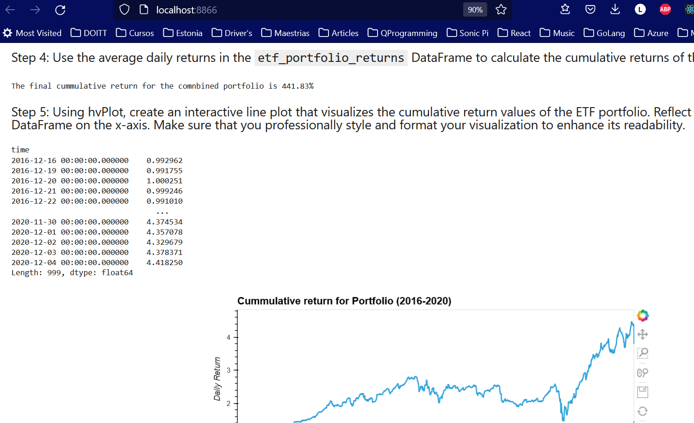

# Challenge VII | ETF Analysis - SQL and Voila |Fintech 

---

This is the 7th challenge, now for evaluating an ETF portafolio extracted via SQL

SQL query language helps retrieve and working with databases to get information from a SQL Server into Python and Pandas for manipulating the data back and forth in between a Python script and a SQL Server.

The database contains the following Stocks

- **GDOT - Green Dot Corporation
- **GS - Goldman Sachs
- **PYPL - Paypal
- **SQ - Square

-- 

## Libraries Used

The main language is Python embeded in Jupyter lab

### jupyter

This modules creates a notebook and processes a python kernel.

### pandas

Library that handles Dataframes and Series to process data, filter, create statistics

### hvplot

Library to plot graphs, enhanced graphics and options

### numpy

Library used to handle numbers and math expressions

### sqlalchemy

Library to connect with a SQLite file directly from python

### voila

Library to convert a Jupyter notebook into a web portal.

---

## Website generated via voila



## Usage

To run program just open the terminal (anaconda needs to be installed) and type the following

``` bash
$ git clone https://github.com/lumiroga/fintech-Challenge7.git
$ cd fintech-Challenge7
$ jupyter lab 

```

Open a browser with the displayed URL in Jupyter

Look for *etf_analyzer.ipnyb* file and open it.

---

## Contributors

[lumiroga](https://github.com/lumiroga)

---

## License

* mpl-2.0 | Mozilla Public License 2.0